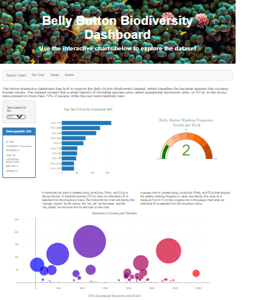
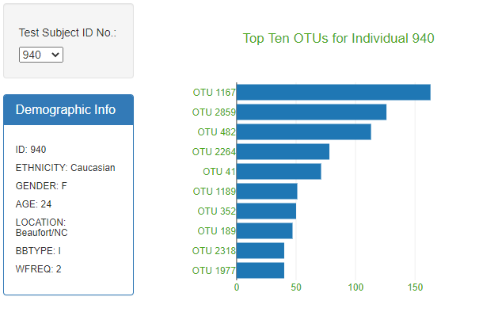
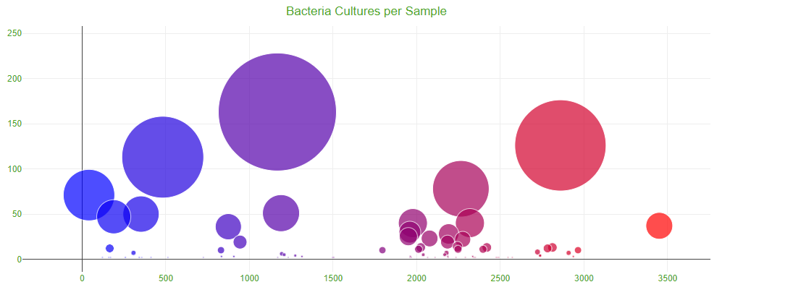
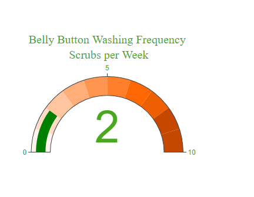

# Overview of Project:

The below interactive dashboard has built to explore the Belly Button Biodiversity dataset, which classifies the bacterial species that 
colonize human navels.
The dataset reveals that a small handful of microbial species (also called operational taxonomic units, or OTUs, n the study) were present 
in more than 70% of people, while the rest were relatively rare.

# Results

1. A horizontal bar chart was created using JavaScript, Plotly, and D3.js with a dropdown menu to display the top 10 OTUs found in that 
   individual. The bar chart has the following:	
 - The top 10 "sample_values" are sorted in descending order
 - The top 10 "sample_values" as values
 - The "otu_ids" as the labels
 

2. Using JavaScript, Plotly, and D3.js,a bubble chart was created that displays the following when an individual’s ID is selected from the
   dropdown menu webpage:
 - The "otu_ids" as the x-axis values.
 - The "sample_values" as the y-axis values.
 - The "sample_values" as the marker size.
 - The "otu_ids" as the marker colors.
 - The "otu_labels" as the hover-text values.
 

 
3. Using JavaScript, Plotly, and D3.js, a gauge chart was created that displays the weekly washing frequency's value, and display the value as
   a measure from 0-10 on the progress bar in the gauge chart when an individual ID is selected from the dropdown menu.
   

